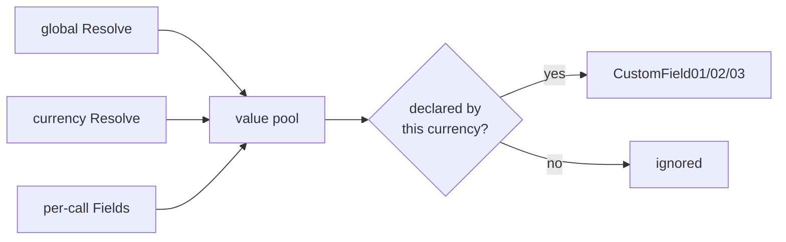

# Economy Analytics

Scribe owns your currency balances, which is half of what Roblox's economy analytics needs. So it emits the other half for you: any currency mutation you **tag** auto-fires `AnalyticsService:LogEconomyEvent`, with the currency name, the amount, and the post-transaction balance filled in from the value Scribe just wrote. You add the dimensions that only you know (transaction type, item, where it happened), and Scribe assembles the event.

## Tagging a mutation

Pass a meta table as the second argument to [`Increment`](/api/Value#Increment) or [`Decrement`](/api/Value#Decrement):

```lua
Data[player].Coins.Increment(50, {
    TransactionType = Enum.AnalyticsEconomyTransactionType.Gameplay,
    ItemSku = "quest_daily_01",
})

Data[player].Gems.Decrement(10, {
    TransactionType = Enum.AnalyticsEconomyTransactionType.Shop,
    ItemSku = "hat_cowboy",
})
```

That is the whole minimum. `Increment` logs a **Source** event, `Decrement` logs a **Sink**, the amount is the positive magnitude, and the ending balance is the value after the write. An **untagged** `Increment(50)` just writes the value and emits nothing, so instrumentation is always opt-in per call.

:::note Enum or string
`TransactionType` accepts an `Enum.AnalyticsEconomyTransactionType` (its `.Name` is extracted for you) or a plain string. Roblox groups the dashboard by the standard transaction-type names, so prefer the enum.
:::

## Soft-currency purchases emit automatically

You never tag [`Data.Purchase`](/api/Server#Purchase): the atomic soft-currency debit fires a **Sink** economy event on its own once the purchase commits. The currency is the `Cost.Path` field, the transaction type and item SKU come from the purchase's `ItemId` (falling back to `Category`), and any custom fields the spent currency declares are filled from its `Resolve`. So a shop purchase is instrumented exactly like a manual `Decrement`, with nothing extra to wire up.

## Multiple currencies come for free

The logged currency is the **field's own name**, so every currency field is its own analytics stream with no extra configuration:

```lua
Data[player].Coins.Increment(100, { TransactionType = "Login" })    -- currency "Coins"
Data[player].Gems.Increment(5, { TransactionType = "Reward" })      -- currency "Gems"
Data[player].Tickets.Decrement(1, { TransactionType = "Raffle" })   -- currency "Tickets"
```

If a currency's display name differs from its field name, override it per currency with `Label` (below) or per call with `Currency`.

## Custom fields

Roblox gives economy events exactly **three custom-field slots** (`CustomField01`, `CustomField02`, `CustomField03`). There are only three, and they are the **same three columns for every economy event**, not three per currency (Roblox caps you at 8,000 unique value combinations across all three slots combined). You can still point each currency's slots at completely different dimensions, so `Money` records `Location`/`Team`/`ItemType` while `Gems` records `Zone`/`Team`/`GemTier`. You just declare, per currency, which dimensions fill the shared slots and in what order. Declare it in the `Economy` option:

```lua
Scribe({
    Template = { Money = Scribe.Int(0, { Min = 0 }), Gems = Scribe.Int(0, { Min = 0 }) },
    -- ...
    Economy = {
        -- Ambient values, resolved once per event and shared across currencies.
        -- A currency only records the ones it declares below.
        Resolve = function(player)
            return { Team = player.Team and player.Team.Name or "Unknown" }
        end,

        -- Format values as "Team - Border Supervisor" (default true).
        Prefix = true,

        Currencies = {
            Money = {
                Label = "Pounds",                             -- logged name (field is "Money")
                Fields = { "Location", "Team", "ItemType" },  -- -> CustomField01 / 02 / 03
            },
            Gems = {
                Fields = {
                    "Zone",
                    { Name = "Team", Prefix = false },        -- per-field prefix override
                },
                -- Currency-specific ambient values, merged over the shared Resolve.
                Resolve = function(player)
                    return { GemTier = computeGemTier(player) }
                end,
            },
        },
    },
})
```

Then supply the per-event dimensions at the call site under `Fields`; the ambient ones come from `Resolve`:

```lua
Data[player].Money.Increment(amount, {
    TransactionType = Enum.AnalyticsEconomyTransactionType.Gameplay,
    ItemSku = "quest_01",
    Fields = { Location = "Lobby", ItemType = "Quest" },   -- Team is filled by Resolve
})
```

### How a value is chosen

For each declared field, in order, Scribe fills the pool from the shared `Resolve`, then the currency's own `Resolve`, then the per-call `Fields` (later wins on a clash), and records the ones the currency declares:



### Why prefix

Because the three slots are shared, two currencies can put different dimensions in the same slot (Money's `Location` and Gems's `Zone` both land in `CustomField01`). Prefixing keeps that slot self-describing on the dashboard: you see `Location - Lobby` and `Zone - Arena` side by side instead of a bare, ambiguous `Lobby`/`Arena`. That is why `Prefix` defaults to `true`. Turn it off globally or per field when a slot always means one thing.

## Porting a hand-rolled system

A typical `IncrementMoney(player, amount, itemSKU, transactionType, location, itemType)` helper collapses into a tagged `Increment`:

```lua
Data[player].Money.Increment(math.abs(amount), {
    TransactionType = transactionType,                       -- Enum or string
    ItemSku = itemSKU,
    Fields = { Location = location, ItemType = itemType },   -- Team comes from Resolve
})
```

The clamp at zero is handled by the field's `Min`, and any UI or badge logic that used to run alongside the manual analytics call moves to an [`Observe`](/api/Value#Observe) on the value, which Scribe already replicates to the client.

## Fail-safe by design

Economy logging never blocks gameplay. A throwing `Resolve` drops only its fields, a throwing `LogEconomyEvent` is caught, and both cases are counted (`EconomyEvents` / `EconomyEventFailures` in [`Scribe.GetMetrics`](/api/Scribe#GetMetrics)) and logged at `Debug` under [`ANALYTICS_FAIL`](./log-codes). In dev mode Scribe also warns on a per-call `Fields` name a currency didn't declare (`ECONOMY_FIELD_UNDECLARED`) and on more than three declared fields (`ECONOMY_FIELDS_OVERFLOW`).

## `EconomyMeta` reference

| Field             | Type                                              | Default                          |
| ----------------- | ------------------------------------------------- | -------------------------------- |
| `Flow`            | `"Source" \| "Sink"`                              | `Increment` -> Source, `Decrement` -> Sink |
| `TransactionType` | `Enum.AnalyticsEconomyTransactionType \| string`  | `"Gameplay"`                     |
| `ItemSku`         | `string`                                          | none                             |
| `Currency`        | `string`                                          | the currency's `Label`, else the field name |
| `Fields`          | `{ [string]: any }`                               | none                             |

`Source` and `Item` are accepted as aliases of `TransactionType` and `ItemSku`. Annotate a meta local with `Scribe.EconomyMeta`, and a config local with `Scribe.EconomyConfig`, for full autocomplete and checking.

## Capturing events in tests

`Economy.LogEconomyEvent` is an injectable seam. It defaults to `AnalyticsService:LogEconomyEvent`; override it to capture emitted events in a test harness (it receives `player, flowType, currency, amount, endingBalance, transactionType, itemSku, customFields`).
