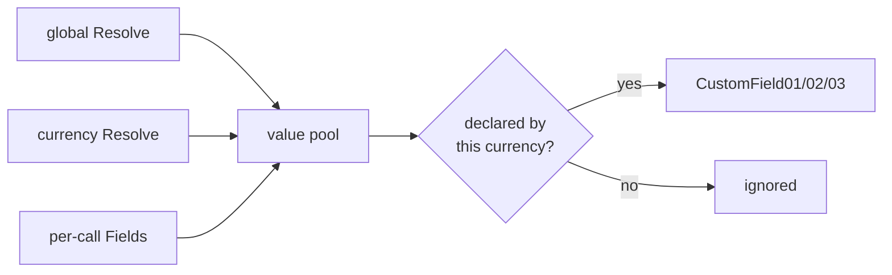

# Economy Analytics

Roblox has a built-in economy dashboard that shows you where currency enters your game and where it leaves. Filling it in normally means calling `AnalyticsService:LogEconomyEvent` by hand at every spot that touches a balance, and getting the ending balance right. Scribe already owns Emberfall's balances, so it emits the event for you: you tag the write, and Scribe fills in the currency, the amount that actually landed, and the new balance.

## Tagging a mutation

Pass a meta table as the second argument to [`Increment`](/api/Value#Increment) or [`Decrement`](/api/Value#Decrement):

```lua
Data[player].Coins.Increment(50, {
    TransactionType = Enum.AnalyticsEconomyTransactionType.Gameplay,
    ItemSku = "quest_the_first_ember",
})

Data[player].Gems.Decrement(10, {
    TransactionType = Enum.AnalyticsEconomyTransactionType.Shop,
    ItemSku = "EmberLantern",
})
```

That is the whole minimum. `Increment` logs a **Source** event, `Decrement` logs a **Sink**, and the currency is the field's own name, so `Coins` and `Gems` are already two separate streams on the dashboard with nothing extra to configure.

Instrumentation is opt-in per call. A plain `Data[player].Coins.Increment(50)` writes the value and emits nothing, which is what you want for the hundreds of small internal adjustments that are not really economy events.

??? note "Clamped writes log what moved, not what you asked for"
    The amount is the effective delta. `Coins` is declared with `Min = 0`, so `Coins.Decrement(50, meta)` against a balance of 30 logs a Sink of **30**. An `Increment` on a field already at its `Max` logs nothing at all, because a zero-delta write emits no event.

    Dashboard totals therefore always match real balance movement. They will not match your call sites if you rely on the field's bounds to do the clamping for you.

??? note "Enum or string for `TransactionType`"
    `TransactionType` accepts an `Enum.AnalyticsEconomyTransactionType`, whose `.Name` is extracted for you, or a plain string. Roblox groups the dashboard by the standard transaction-type names, so prefer the enum. A missing `TransactionType` defaults to `"Gameplay"`.

## Soft-currency purchases emit on their own

You never tag [`Data.Purchase`](/api/Server#Purchase). The atomic debit fires a Sink event by itself once the purchase commits:

```lua
Data.Purchase(player, {
    Cost = { Path = "Coins", Amount = 250 },
    Category = "Item",
    ItemId = "EmberLantern",
    Grant = function(data)
        data.Inventory.EmberLantern.Set({ Qty = 1, Rarity = "Rare" })
    end,
})
-- Sink, currency "Coins", amount 250, SKU "EmberLantern"
```

The currency is the `Cost.Path` field. The transaction type and the item SKU both come from `ItemId`, with the transaction type falling back to `Category` when there is no `ItemId`. Custom fields are filled from your `Resolve` functions as usual. The one thing a purchase event cannot carry is a per-call `Fields` dimension, because there is no call site to put one on.

## Robux grants do not emit

That automatic path covers `Data.Purchase` alone. A [product](./monetization#selling-a-coin-pack) `Grant` is an ordinary write, so it logs nothing unless you tag it, and currency bought with Robux is usually a game's largest Source stream. This is why the canonical Emberfall products carry a meta table:

```lua
Products = {
    CoinPack500 = {
        Id = 1234567890,
        Category = "Currency",
        Grant = function(data)
            data.Coins.Increment(500, {
                TransactionType = Enum.AnalyticsEconomyTransactionType.IAP,
                ItemSku = "CoinPack500",
            })
        end,
    },
},
```

A `Grant` runs inside a transaction, so the event is held until the grant commits and dropped if the receipt rolls back.

## Rolled-back transactions emit nothing

A tagged `Increment` or `Decrement` inside [`Data.Transaction`](./transactions) does not log at the moment it runs. Its event is held alongside the transaction's deferred writes and fires only once the transaction commits. A transaction that fails, by throwing or by yielding, leaves no economy event behind.

So an Emberfall shop flow that debits `Coins` and then errors while granting the item rolls the balance back and logs no sink. Your dashboard never shows a spend that did not happen.

Outside a transaction, including inside a plain `Batch`, events fire immediately.

## Custom fields

Roblox gives economy events exactly **three** custom-field slots: `CustomField01`, `CustomField02` and `CustomField03`. There are only three, and they are the same three columns for every economy event, not three per currency. You declare, per currency, which dimensions fill those slots and in what order:

```lua
Economy = {
    -- Ambient values, resolved once per event and shared across currencies.
    Resolve = function(player)
        return { Zone = currentZone(player) }
    end,

    -- Format values as "Zone - Emberfall Keep" (default true).
    Prefix = true,

    Currencies = {
        Coins = {
            Fields = { "Zone", "ItemType" },   -- CustomField01, CustomField02
        },
        Gems = {
            Label = "Emberstones",             -- logged name; the field is still Gems
            Fields = { "Zone", { Name = "Party", Prefix = false } },
            -- Currency-specific ambient values, merged over the shared Resolve.
            Resolve = function(player)
                return { Party = partyIdFor(player) }
            end,
        },
    },
},
```

Then supply the per-event dimensions at the call site under `Fields`. The ambient ones come from `Resolve`:

```lua
Data[player].Coins.Increment(50, {
    TransactionType = Enum.AnalyticsEconomyTransactionType.Gameplay,
    ItemSku = "quest_the_first_ember",
    Fields = { ItemType = "Quest" },   -- Zone is filled by Resolve
})
```

A dimension only reaches the dashboard if that currency lists it in `Fields`. A value your `Resolve` returns but `Fields` does not name is dropped.

### How a value is chosen

For each declared field, in order, Scribe fills a pool from the shared `Resolve`, then the currency's own `Resolve`, then the per-call `Fields`. Later wins on a clash. It then records the ones the currency declares:


```mermaid
flowchart LR
    A[global Resolve] --> P[value pool]
    B[currency Resolve] --> P
    C[per-call Fields] --> P
    P --> D{declared by<br/>this currency?}
    D -->|yes| S[CustomField01/02/03]
    D -->|no| X[ignored]
```

??? note "Why values are prefixed by default"
    Because the three slots are shared, two currencies can put different dimensions in the same slot. Emberfall's `Coins` puts `ItemType` in `CustomField02` while `Gems` puts `Party` there.

    Prefixing keeps that slot self-describing on the dashboard: you see `ItemType - Quest` and `Party - 41`, instead of a bare and ambiguous `Quest` and `41`. That is why `Prefix` defaults to `true`. Turn it off globally, or per field as `Gems` does above, when a slot always means one thing.

    One more limit worth knowing: Roblox caps you at 8,000 unique value combinations across all three slots combined. Do not put a player id or a timestamp in one.

## Porting a hand-rolled system

A typical `IncrementCoins(player, amount, itemSKU, transactionType, zone, itemType)` helper collapses into a tagged `Increment`:

```lua
Data[player].Coins.Increment(math.abs(amount), {
    TransactionType = transactionType,        -- Enum or string
    ItemSku = itemSKU,
    Fields = { ItemType = itemType },         -- Zone comes from Resolve
})
```

The clamp at zero is handled by the field's `Min`, which is where the [clamped-amount rule](#tagging-a-mutation) starts to matter: a spend of 50 against a balance of 30 now logs 30, where a hand-rolled helper that clamped first would have logged whichever number it chose to pass along.

Any UI or badge logic that used to run alongside the manual analytics call moves to an [`Observe`](/api/Value#Observe) on the value, which Scribe already replicates to the client.

## `EconomyMeta` reference

| Field | Type | Default |
| --- | --- | --- |
| `Flow` | `"Source" \| "Sink"` | `Increment` gives Source, `Decrement` gives Sink |
| `TransactionType` | `Enum.AnalyticsEconomyTransactionType \| string` | `"Gameplay"` |
| `ItemSku` | `string` | none |
| `Currency` | `string` | the currency's `Label`, else the field name |
| `Fields` | `{ [string]: any }` | none |

`Source` and `Item` are accepted as aliases of `TransactionType` and `ItemSku`. Annotate a meta local with `Scribe.EconomyMeta`, and a config local with `Scribe.EconomyConfig`, for full autocomplete and checking.

??? note "Tagging a `Scribe.Big` currency"
    A tagged `Increment` or `Decrement` on a [`Scribe.Big`](./big-numbers) field, such as Emberfall's prestige `Essence`, emits through the same path with no extra setup. Two things to know.

    **The reported numbers are doubles.** `LogEconomyEvent` takes plain numbers, so the amount and the ending balance are converted out of the big at that boundary. Past about 15 significant digits they round, and past `1.8e308` they saturate to infinity, which is precisely the range a big currency exists for. The event still reaches the dashboard; the figure on it is approximate. Scribe prefers that over a value that would throw inside the analytics call and be swallowed.

    **`Multiply` and `Divide` cannot be tagged.** Their signature is `(factor, replicate: boolean?)`, with no meta slot, so a meta table passed there is read as the `replicate` argument and quietly ignored. You get no error and no event. Since `Multiply` is the idiomatic big operation, a multiplier you want instrumented has to be expressed as an `Increment` of the difference:

    ```lua
    local essence = Data[player].Essence
    essence.Increment(essence.Get() * 0.15, {   -- a 15% VIP bonus, instrumented
        TransactionType = Enum.AnalyticsEconomyTransactionType.TimedReward,
    })
    ```

??? note "Nothing here can break gameplay"
    Economy logging is fail-safe by construction. A `Resolve` that throws drops only its own fields, a `LogEconomyEvent` that throws is caught, and both cases are counted as `EconomyEvents` and `EconomyEventFailures` in [`Scribe.GetMetrics`](/api/Scribe#GetMetrics) and logged at `Debug` under [`ANALYTICS_FAIL`](./log-codes#integrity).

    In DevMode Scribe also warns on a per-call `Fields` name the currency did not declare (`ECONOMY_FIELD_UNDECLARED`) and on more than three declared fields (`ECONOMY_FIELDS_OVERFLOW`), both of which are silent data loss otherwise.

??? tip "Capturing events in a test"
    `Economy.LogEconomyEvent` is an injectable seam. It defaults to `AnalyticsService:LogEconomyEvent`, and you override it to capture what a test harness emits:

    ```lua
    Economy = {
        LogEconomyEvent = function(player, flowType, currency, amount, endingBalance, transactionType, itemSku, customFields)
            table.insert(captured, { Currency = currency, Amount = amount, Balance = endingBalance })
        end,
    },
    ```

    See [Testing & Edit Mode](./testing) for wiring one up.

## Where to next

- [Monetization](./monetization) for the products and purchases these events describe.
- [Cross-Key Transactions](./transactions) for why a rolled-back transaction emits nothing.
- [Configuration](./configuration) for the `Economy` option in full.
- [Diagnostics](./diagnostics) for the counters that tell you the pipeline is alive.
