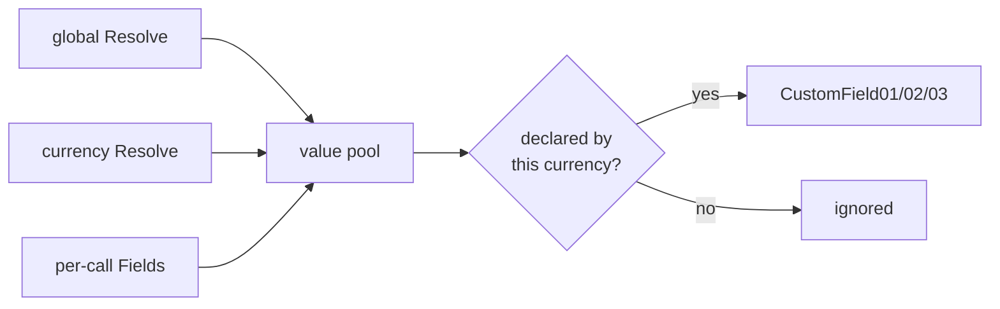

# Economy Analytics

Scribe owns your currency balances, which is half of what Roblox's economy analytics needs. So it emits the other half for you: any currency mutation you **tag** auto-fires `AnalyticsService:LogEconomyEvent`, with the currency name, the amount, and the post-transaction balance filled in from the value Scribe just wrote. You add the dimensions that only you know (transaction type, item, where it happened), and Scribe assembles the event.

## Tagging a mutation

Pass a meta table as the second argument to [`Increment`](/api/Value#Increment) or [`Decrement`](/api/Value#Decrement):

```lua
Data[player].Coins.Increment(50, {
    TransactionType = Enum.AnalyticsEconomyTransactionType.Gameplay,
    ItemSku = "quest_daily_01",
})

Data[player].Gems.Decrement(10, {
    TransactionType = Enum.AnalyticsEconomyTransactionType.Shop,
    ItemSku = "hat_cowboy",
})
```

That is the whole minimum. `Increment` logs a **Source** event, `Decrement` logs a **Sink**, the amount is the positive magnitude of the change that **actually landed**, and the ending balance is the value after the write. An **untagged** `Increment(50)` just writes the value and emits nothing, so instrumentation is always opt-in per call.

:::note Clamped writes log what moved
The amount is the effective delta, not what you asked for. `Coins.Decrement(50, meta)` against a balance of 30 on a field with `Min = 0` logs a Sink of **30**, and an `Increment` on a field already at `Max` logs **nothing at all**, because a zero-delta write emits no event. Dashboard totals therefore always match real balance movement, but they will not match your call sites if you rely on the field's bounds to do the clamping.
:::

:::note Enum or string
`TransactionType` accepts an `Enum.AnalyticsEconomyTransactionType` (its `.Name` is extracted for you) or a plain string. Roblox groups the dashboard by the standard transaction-type names, so prefer the enum.
:::

## Soft-currency purchases emit automatically

You never tag [`Data.Purchase`](/api/Server#Purchase): the atomic soft-currency debit fires a **Sink** economy event on its own once the purchase commits. The currency is the `Cost.Path` field, the transaction type and item SKU both come from the purchase's `ItemId` (the transaction type falls back to `Category` when there is no `ItemId`; the SKU does not), and any custom fields the spent currency declares are filled from the shared **and** currency-level `Resolve`. So a shop purchase is instrumented exactly like a manual `Decrement`, with nothing extra to wire up. The only thing a purchase event cannot carry is a per-call `Fields` dimension, since there is no call site to put one on.

## Robux grants do not emit

That automatic path covers [`Data.Purchase`](/api/Server#Purchase) alone. A [product](./monetization#configuring-products-and-passes) `Grant` that credits currency is an ordinary write, so it logs nothing unless you tag it, and currency bought with Robux is usually a game's largest **Source** stream:

```lua
Products = {
    Coins1000 = { Id = 111, Category = "Currency",
        Grant = function(data)
            data.Coins.Increment(1000, {
                TransactionType = Enum.AnalyticsEconomyTransactionType.IAP,
                ItemSku = "coins_1000",
            })
        end },
},
```

A `Grant` runs inside a transaction, so this behaves like the section below: the event is held until the grant commits and dropped if the receipt rolls back.

## Rolled-back transactions emit nothing

A tagged `Increment` or `Decrement` inside [`Data.Transaction`](./lifecycle#batching-and-transactions) does not log at the moment it runs. Its event is held alongside the transaction's deferred writes and fires only once the transaction commits, so a transaction that fails, by throwing or by yielding (which Scribe refuses), leaves no economy event behind. A shop flow that debits `Coins` and then errors while granting the item rolls the balance back and logs no sink, so your dashboard never shows a spend that did not happen.

Outside a transaction, including inside a plain `Batch`, events fire immediately as before.

## Multiple currencies come for free

The logged currency is the **field's own name**, so every currency field is its own analytics stream with no extra configuration:

```lua
Data[player].Coins.Increment(100, { TransactionType = "Login" })    -- currency "Coins"
Data[player].Gems.Increment(5, { TransactionType = "Reward" })      -- currency "Gems"
Data[player].Tickets.Decrement(1, { TransactionType = "Raffle" })   -- currency "Tickets"
```

If a currency's display name differs from its field name, override it per currency with `Label` (below) or per call with `Currency`.

## `Scribe.Big` currencies

A tagged `Increment` or `Decrement` on a [`Scribe.Big`](./templates#big-numbers) field emits through the same path with no extra setup. Two things to know.

**The reported numbers are doubles.** `LogEconomyEvent` takes plain numbers, so the amount and ending balance are converted out of the big at that boundary. Past about 15 significant digits they round, and past `1.8e308` they saturate to `inf`, which is precisely the range a big currency exists for. The event still reaches the dashboard; the figure on it is approximate. Scribe prefers that over a value that would throw inside the analytics call and be swallowed.

**`Multiply` and `Divide` cannot be tagged.** Their signature is `(factor, replicate: boolean?)`, with no meta slot. A meta table passed there is read as the `replicate` argument and quietly ignored, so you get no error and no event. Since `Multiply` is the idiomatic big operation, a multiplier grant you want instrumented has to be expressed as an `Increment` of the difference:

```lua
local coins = data.Coins
coins.Increment(coins.Get() * 0.15, {   -- a 15% bonus, instrumented
    TransactionType = Enum.AnalyticsEconomyTransactionType.TimedReward,
})
```

## Custom fields

Roblox gives economy events exactly **three custom-field slots** (`CustomField01`, `CustomField02`, `CustomField03`). There are only three, and they are the **same three columns for every economy event**, not three per currency (Roblox caps you at 8,000 unique value combinations across all three slots combined). You can still point each currency's slots at completely different dimensions, so `Money` records `Location`/`Team`/`ItemType` while `Gems` records `Zone`/`Team`. You declare, per currency, which dimensions fill the shared slots and in what order. A dimension only reaches the dashboard if it is named in that currency's `Fields`: a value your `Resolve` returns but `Fields` does not list is dropped. Declare it in the `Economy` option:

```lua
Scribe({
    Template = { Money = Scribe.Int(0, { Min = 0 }), Gems = Scribe.Int(0, { Min = 0 }) },
    -- ...
    Economy = {
        -- Ambient values, resolved once per event and shared across currencies.
        -- A currency only records the ones it declares below.
        Resolve = function(player)
            return { Team = player.Team and player.Team.Name or "Unknown" }
        end,

        -- Format values as "Team - Border Supervisor" (default true).
        Prefix = true,

        Currencies = {
            Money = {
                Label = "Pounds",                             -- logged name (field is "Money")
                Fields = { "Location", "Team", "ItemType" },  -- -> CustomField01 / 02 / 03
            },
            Gems = {
                Fields = {
                    "Zone",
                    { Name = "Team", Prefix = false },        -- per-field prefix override
                },
                -- Currency-specific ambient values, merged over the shared Resolve.
                Resolve = function(player)
                    return { GemTier = computeGemTier(player) }
                end,
            },
        },
    },
})
```

Then supply the per-event dimensions at the call site under `Fields`; the ambient ones come from `Resolve`:

```lua
Data[player].Money.Increment(amount, {
    TransactionType = Enum.AnalyticsEconomyTransactionType.Gameplay,
    ItemSku = "quest_01",
    Fields = { Location = "Lobby", ItemType = "Quest" },   -- Team is filled by Resolve
})
```

### How a value is chosen

For each declared field, in order, Scribe fills the pool from the shared `Resolve`, then the currency's own `Resolve`, then the per-call `Fields` (later wins on a clash), and records the ones the currency declares:


```mermaid
flowchart LR
    A[global Resolve] --> P[value pool]
    B[currency Resolve] --> P
    C[per-call Fields] --> P
    P --> D{declared by<br/>this currency?}
    D -->|yes| S[CustomField01/02/03]
    D -->|no| X[ignored]
```

### Why prefix

Because the three slots are shared, two currencies can put different dimensions in the same slot (Money's `Location` and Gems's `Zone` both land in `CustomField01`). Prefixing keeps that slot self-describing on the dashboard: you see `Location - Lobby` and `Zone - Arena` side by side instead of a bare, ambiguous `Lobby`/`Arena`. That is why `Prefix` defaults to `true`. Turn it off globally or per field when a slot always means one thing.

## Porting a hand-rolled system

A typical `IncrementMoney(player, amount, itemSKU, transactionType, location, itemType)` helper collapses into a tagged `Increment`:

```lua
Data[player].Money.Increment(math.abs(amount), {
    TransactionType = transactionType,                       -- Enum or string
    ItemSku = itemSKU,
    Fields = { Location = location, ItemType = itemType },   -- Team comes from Resolve
})
```

The clamp at zero is handled by the field's `Min`. That is also where the [clamped-amount rule](#tagging-a-mutation) starts to matter: once the bounds do the clamping, a spend of 50 against a balance of 30 logs 30, where a hand-rolled helper that clamped first would have logged whichever number it chose to pass along. Any UI or badge logic that used to run alongside the manual analytics call moves to an [`Observe`](/api/Value#Observe) on the value, which Scribe already replicates to the client.

## Fail-safe by design

Economy logging never blocks gameplay. A throwing `Resolve` drops only its fields, a throwing `LogEconomyEvent` is caught, and both cases are counted (`EconomyEvents` / `EconomyEventFailures` in [`Scribe.GetMetrics`](/api/Scribe#GetMetrics)) and logged at `Debug` under [`ANALYTICS_FAIL`](./log-codes). In dev mode Scribe also warns on a per-call `Fields` name a currency didn't declare (`ECONOMY_FIELD_UNDECLARED`) and on more than three declared fields (`ECONOMY_FIELDS_OVERFLOW`).

## `EconomyMeta` reference

| Field             | Type                                              | Default                          |
| ----------------- | ------------------------------------------------- | -------------------------------- |
| `Flow`            | `"Source" \| "Sink"`                              | `Increment` -> Source, `Decrement` -> Sink |
| `TransactionType` | `Enum.AnalyticsEconomyTransactionType \| string`  | `"Gameplay"`                     |
| `ItemSku`         | `string`                                          | none                             |
| `Currency`        | `string`                                          | the currency's `Label`, else the field name |
| `Fields`          | `{ [string]: any }`                               | none                             |

`Source` and `Item` are accepted as aliases of `TransactionType` and `ItemSku`. Annotate a meta local with `Scribe.EconomyMeta`, and a config local with `Scribe.EconomyConfig`, for full autocomplete and checking.

## Capturing events in tests

`Economy.LogEconomyEvent` is an injectable seam. It defaults to `AnalyticsService:LogEconomyEvent`; override it to capture emitted events in a test harness (it receives `player, flowType, currency, amount, endingBalance, transactionType, itemSku, customFields`).
